> 所有的实验说明都放在这个README里面哦~ o(*￣▽￣*)ブ

# 实验一 安装相关程序

>安装一个小小的 Android Studio

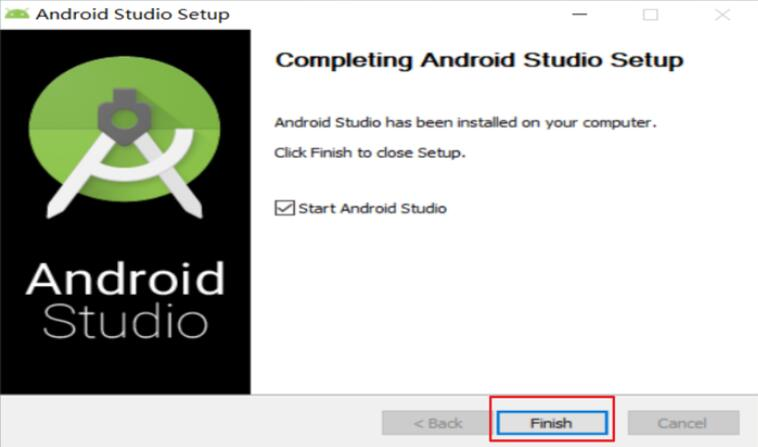

> 接着安装 Anaconda

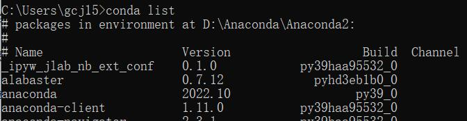

> 再安装 Jupyter

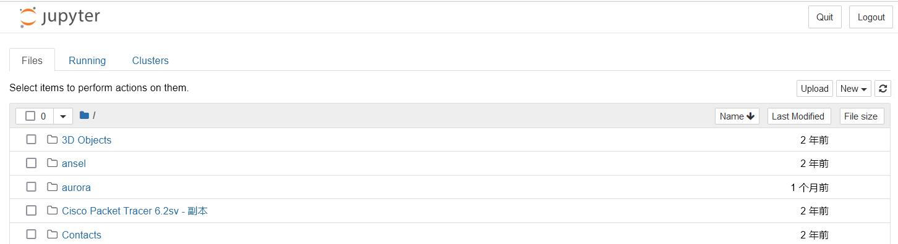

> 最后安装 VS Code！

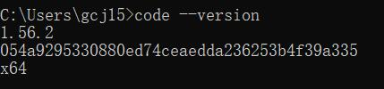

# 实验二 安卓应用实践

#### 实现第一个Kotlin应用

> 实现第一个手机框架界面

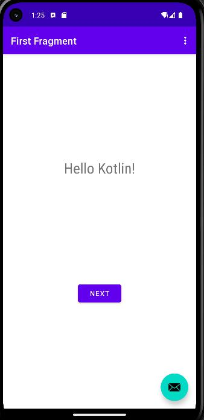

> 添加按钮并设置水平垂直依赖，实现计数

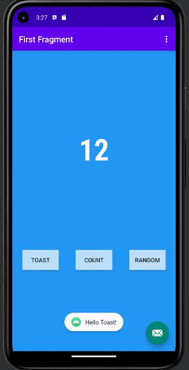

> 完成两个页面的跳转关联

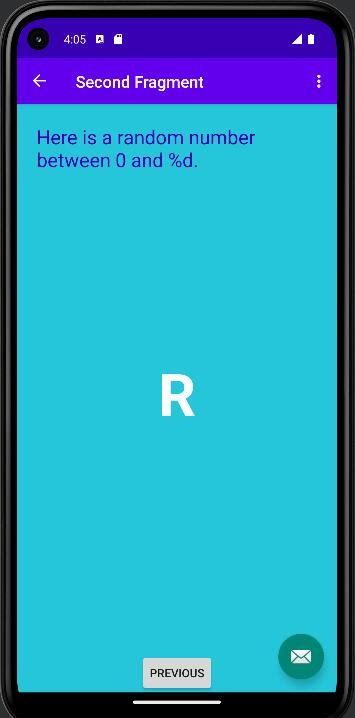

#### 构建CameraX应用

> 搭建初始框架

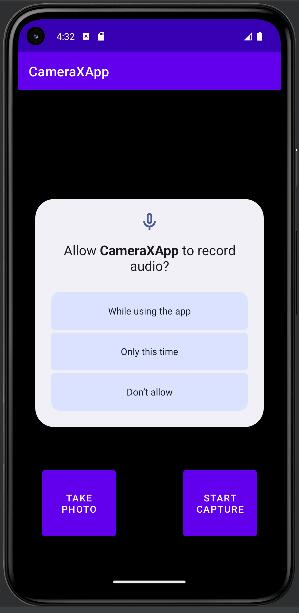

> 实现摄像头的拍照功能

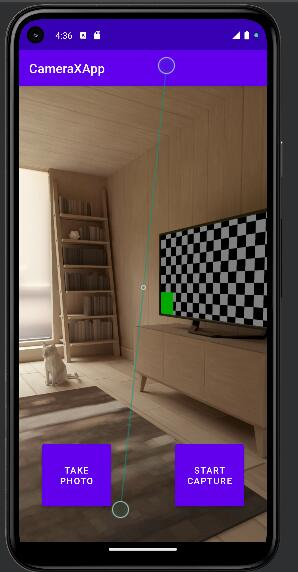

> 添加拍照成功通知

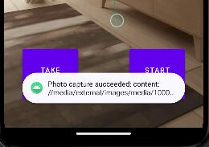

> 查看相片

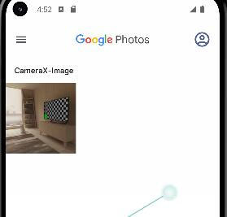

> 添加摄像功能

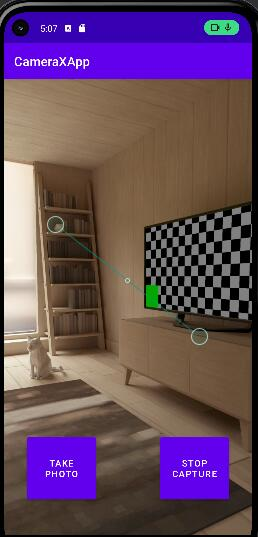

# 实验三 Notebook基础实践

>  读入数据集

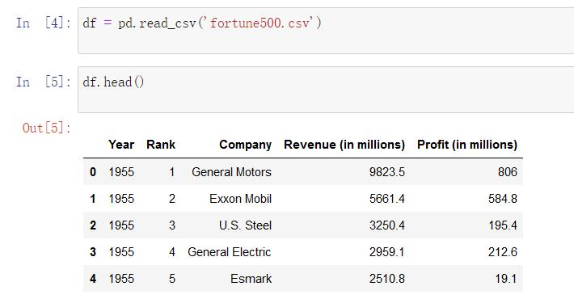

> 使用直方图显示一下利润按照年份的分布情况

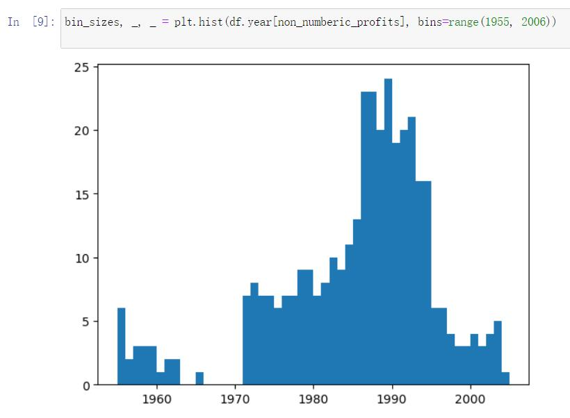

> 使用matplotlib进行画图，显示利润走势

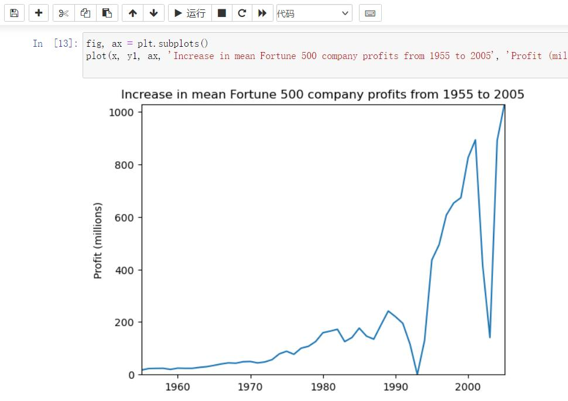

> 同理查看收入走势

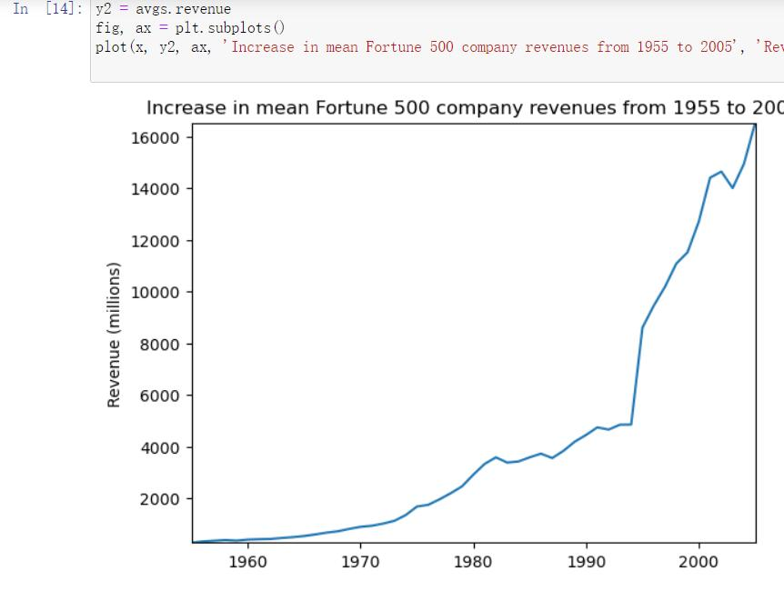

> 查看不同公司之间的收入和利润差距

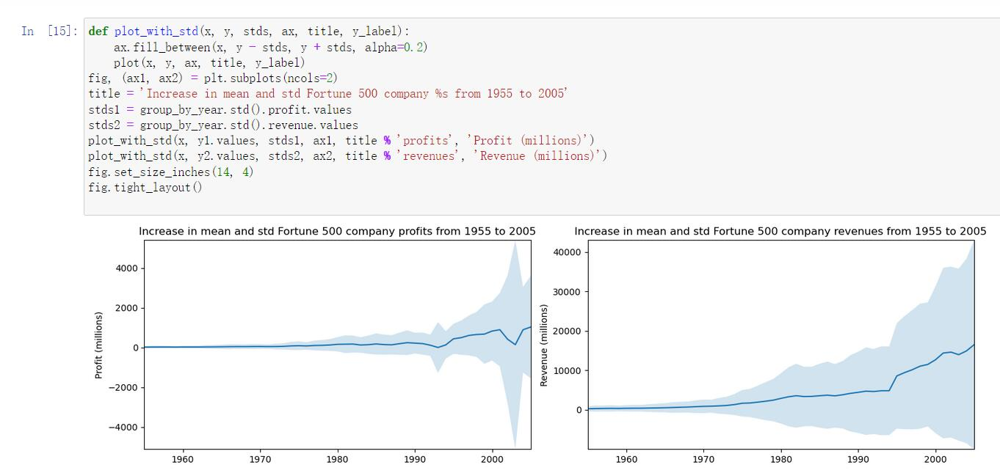

# 实验四 实现图像分类APP

> 将训练完成的APP导入手机，检测玫瑰的分类可能性如下

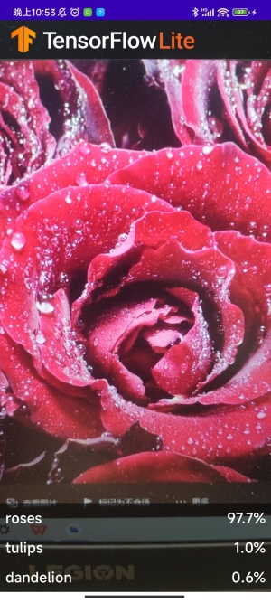

> 检测雏菊的分类可能性如下

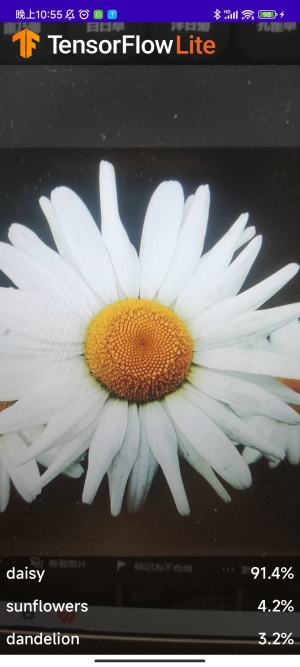

# 未完待续。。。

